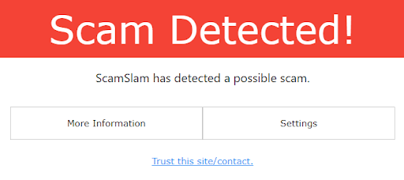
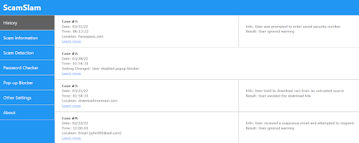
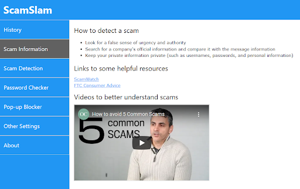
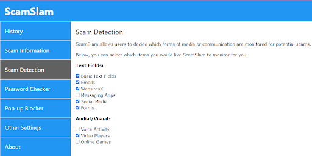
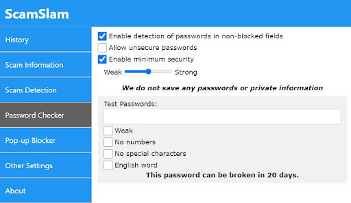
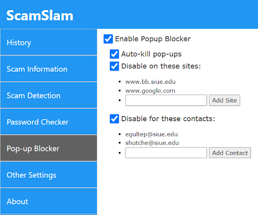

## The Problem
Millions of people encounter scams every day. These scams can look convincing, and no one is completely immune to them. There are many scams out there, such as hacking, phishing, viruses, fraud, and impersonation, so it can be hard to keep track and stay informed of each method.

## The Solution  
To combat these many methods of scams, we've designed a suite of anti-scam software that specializes in detecting, notifying, and educating the user about scams as they happen.  

## Features  
**Scam Blocking:** Alert the user of scams as they are detected  
  
  
  
**Scam Logging:** Inform the user of scams that were avoided  
  
  
  
**Education/Resources:** Teach the user about specific scams as they arise  
  
  
  
**Customizable Settings:** Adjust settings to suit the user's preferences  
  
  
  
**Password Security:** Allow the user to test passwords for security, and set minimum standards for the security level of passwords on the device   
  
  
  
**Popup Blocker:** Block popups from untrusted sites or contacts  
  
  
  

## Design Process
### Research
We made decisions about our design goals through interviews, contextual inquiry, sketches, and storyboards.  
Read more about it in these project documents:  
[Presentation](./docs/Project2H.pdf)  
[Report](./docs/Project2I.pdf)  
### Prototyping
We refined our design through multiple paper prototypes, usability tests, and a digital mockup.  
Learn more about it here:  
[Presentation](./docs/Project3F.pdf)  
[Report](./docs/Project3G.pdf)  

## Interactive Digital Mockup
[Test out our scam detection UI here.](detected.html) 
